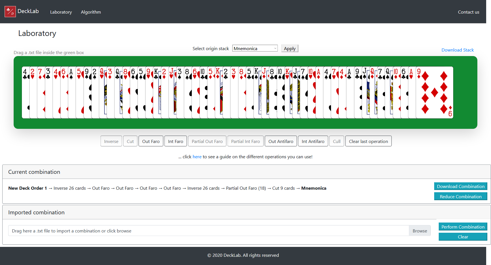

# DeckLab
A webpage where you can have a digital deck, make your experiments and discover combinations. Express, Bootstrap and JQuery.



## Install

To install, clone this repository and install all dependencies:
```
npm install
``` 

To run the app: 
```
npm run dev
```
or
```
npm start
```

The app will be found at http://localhost:3000/